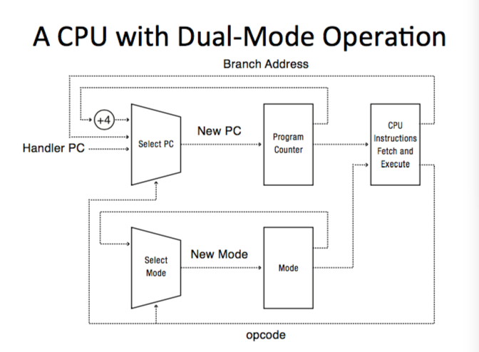

### Operating System: Software to manage a computer's resources for its users and applications
  * Execute user programs and make soling user problems easier
  * Make the computer system convenient to use

### Address Space: Set of rights of a process
  * Memory that the process can access
    * Includes:
      * Code/Data Space
      * Execution Stack
      * Heap
      * OS Address Space

 Modes:
  * Kernel Mode:
    * Execution with full privileges of the hardware
    * Read/Write to any memory, access any I/O device
    * Read/Wtite to any disk sector
    * Send/receive any packet

  * User Mode:
    * Limited privileges
    * Only those granted by the operating system kernel

  * In x86 --  mode stored in `EFLAGS` register
  * In MIPS -- mode stored in the `status` register

### Hardware Support
  * Privileged instructions
    * Available to kernel
    * Not available to user code
  * Limits on memory access
    * Prevents user code from overwriting the kernel
  * Timer
    * To regain control from a user program in a loop

### Memory Protection / Usage
  * For an application process to execute:
    * The process must be in memory
    * The OS must be in memory
      * Starts program
      * Handles interrupts and processor exceptions
      * Handles application system calls
